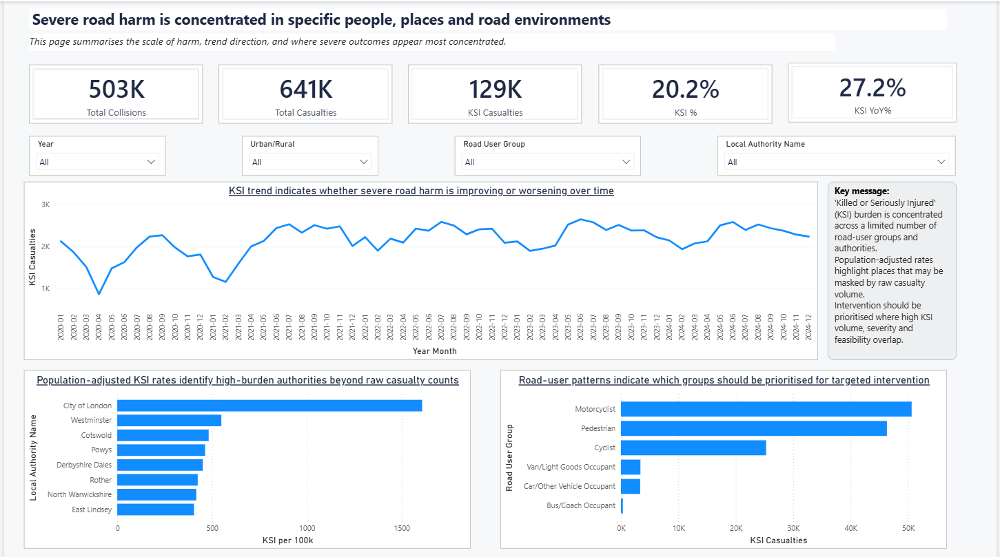
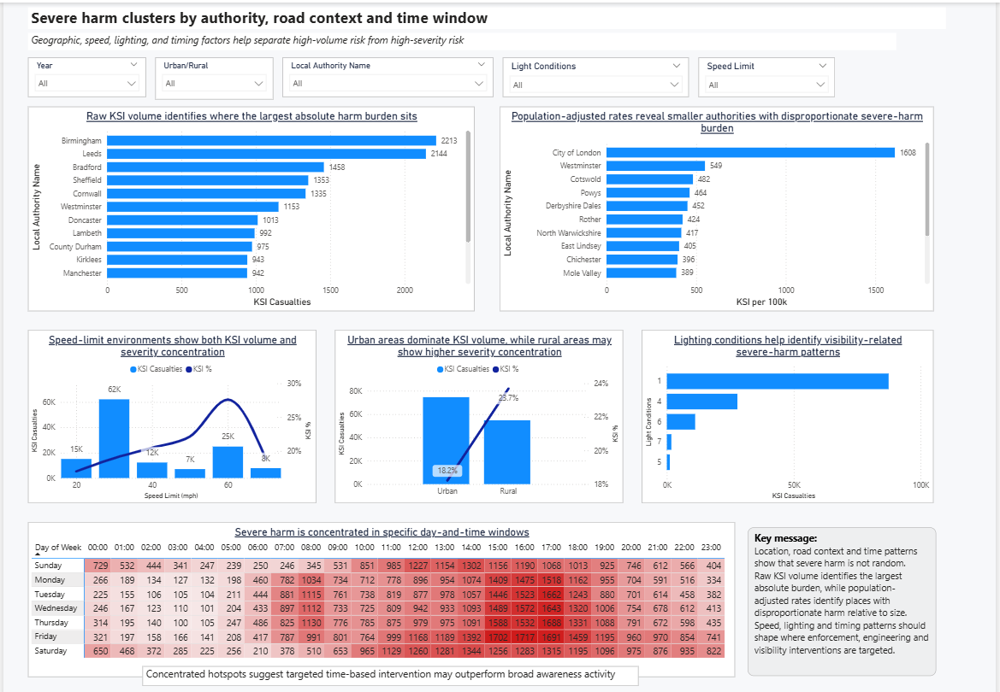
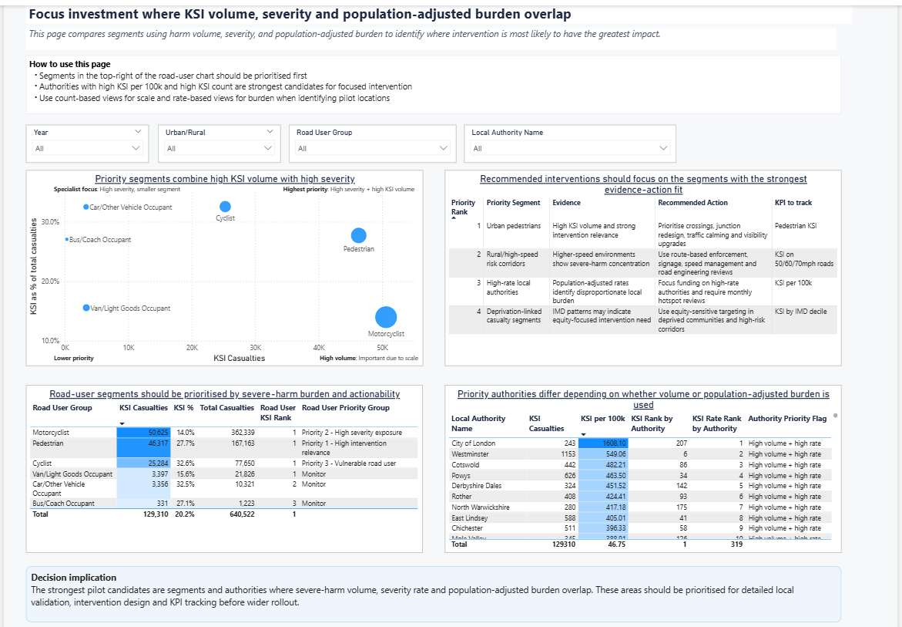
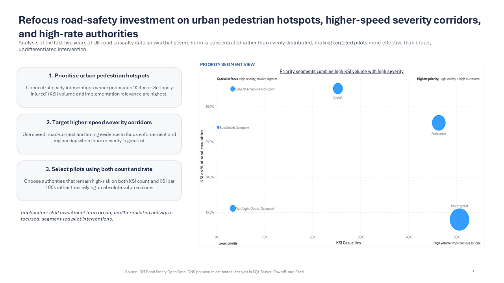
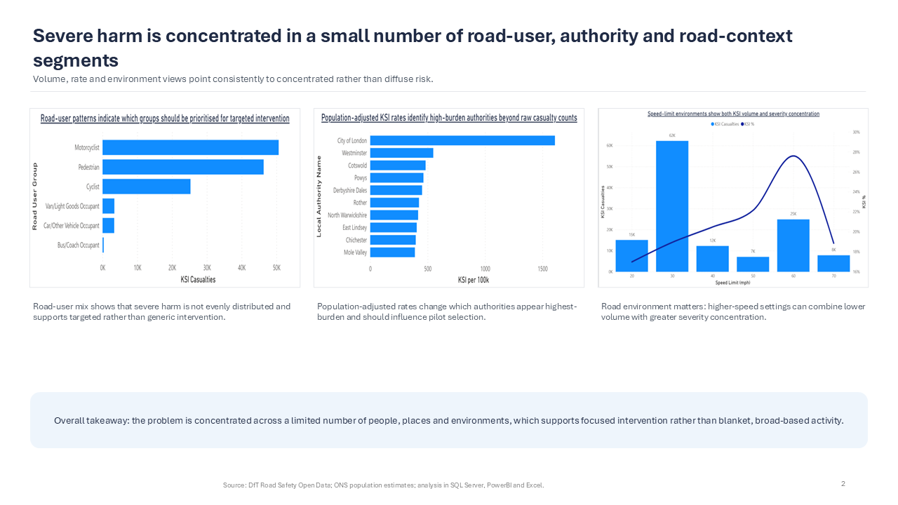
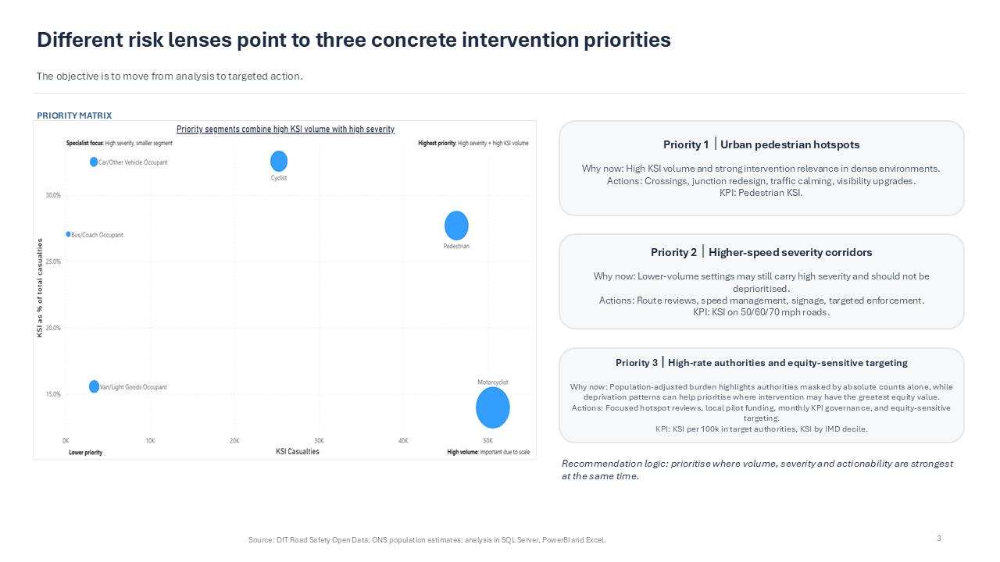
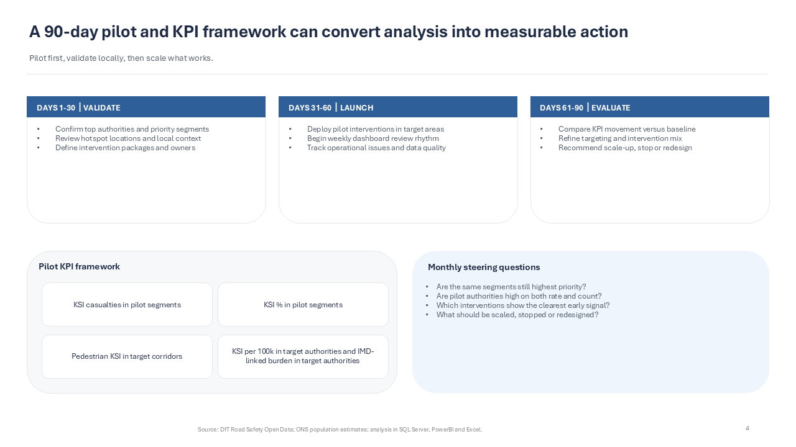

# UK Road Safety Intervention Strategy

## Project Links
- **Portfolio case study:** https://georgeoduk.github.io/road-safety.html
- **GitHub repository:** https://github.com/GeorgeOduk/uk-road-safety-intervention-strategy

## Project Overview

This is a consulting-style road safety analytics project using SQL Server, Power BI, Excel and PowerPoint.

The project answers the question:

**Where should limited road-safety investment be targeted to reduce people killed or seriously injured (KSI) most effectively?**

Using official UK Department for Transport road safety data and Office for National Statistics population estimates, the project analyses severe road harm by road-user group, geography, speed environment, lighting conditions, deprivation and time pattern.

The final output is a decision-focused dashboard and executive recommendation deck designed to simulate the type of analytical work produced in a consulting or public-sector strategy environment.

---

## Executive Recommendation

**Refocus road-safety investment on urban pedestrian hotspots, higher-speed severity corridors, high-rate authorities and equity-sensitive targeting.**

The analysis indicates that severe harm is concentrated rather than evenly distributed, supporting targeted pilot interventions rather than broad, undifferentiated road-safety activity.

---

## Tools Used

- SQL Server
- Power BI
- Excel
- PowerPoint
- GitHub

---

## Data Sources

The project uses:

1. Department for Transport Road Safety Open Data
   - collisions
   - vehicles
   - casualties

2. Office for National Statistics population estimates
   - local-authority population data

The DfT data provides the main road safety analysis base. The ONS population data is used to calculate population-adjusted rates such as KSI per 100,000 population.

The raw data files are not committed to this repository because they are large public datasets. Full download instructions are provided in `data/raw/README.md`.

---

## Key Metrics

- Total collisions
- Total casualties
- KSI casualties
- KSI %
- KSI year-on-year %
- KSI per 100,000 population
- KSI rank by authority
- KSI rate rank by authority
- KSI by IMD decile

---

## Dashboard Pages

### 1. Executive Summary

This page summarises the scale of harm, trend direction and where severe outcomes appear most concentrated.



---

### 2. Who is Most at Risk?

This page identifies who is most exposed and where severity appears concentrated across casualty types.



---

### 3. Where and When is Risk Concentrated?

Geographic, speed, lighting and timing factors help separate high-volume risk from high-severity risk.


---

### 4. Intervention Targeting

This page compares segments using harm volume, severity and population-adjusted burden to identify where intervention is most likely to have the greatest impact.



---

## Executive Slide Deck

The PowerPoint deck translates the dashboard into a concise executive recommendation.

### Slide 1: Answer-first recommendation



### Slide 2: Evidence of concentration



### Slide 3: Priority interventions



### Slide 4: 90-day pilot and KPI framework



---

## Project Structure

```text
uk-road-safety-intervention-strategy/
│
├── README.md
├── powerbi/
├── slides/
├── excel/
├── sql/
├── images/
├── data/
└── docs/
